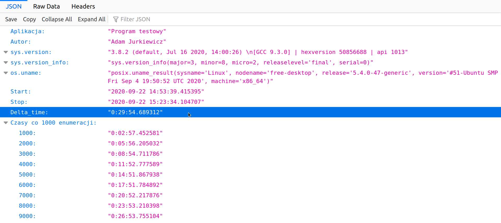
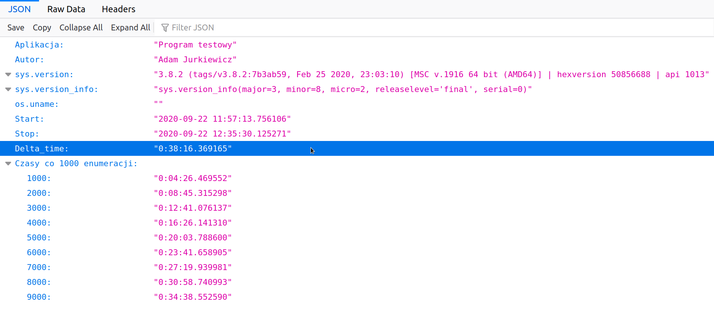

# test_pythona

## Skrypt testujący wydajność Python'a w systemie

Skrypt wykonuje pętlę 10 000 obliczeń funkcji kwadratowej dla 200 wartości X,
tworząc 200 wartości Y, a następnie tworzy obraz korzystając z biblioteki `matplotlib`.

#### Uwaga dla Windows - potrzeba zainstalować dwa moduły:

```python
pip install matplotlib
pip install msvc-runtime
````

Dane poniżej to realny test wykonany na komputerze Dell SFF Optiplex 7010

`CPU: Core i5 (4x2.9 GHz) | RAM: 4 GB`

```bash
lrwxrwxrwx  1 adasiek adasiek    22 wrz 22 18:32 plik_danych_linux.json -> Linux/plik_danych.json
lrwxrwxrwx  1 adasiek adasiek    24 wrz 22 18:32 plik_danych_windows.json -> Windows/plik_danych.json
-rw-rw-r--  1 adasiek adasiek  2944 wrz 22 09:32 python_test.py
```

## Wyniki przedstawiają się następująco:


### Linux - zdecydowany zwycięzca
### ok 10% szybszy na tym samym komputerze.



----

### Windows - zdecydowany przegrany:

### 
